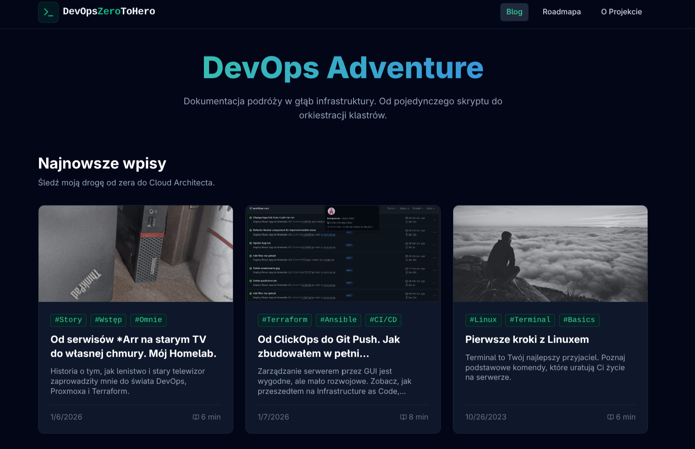

# DevOps from ZERO to HERO journey

[**LIVE DEMO: devops.mrozy.org**](https://devops.mrozy.org) &nbsp;&nbsp;&nbsp; [**DEV PREVIEW: vibe-dev.mrozy.org**](https://vibe-dev.mrozy.org)

---

## Project Overview
This repository serves as a **Proof of Work** and a living documentation of my journey towards becoming a Junior DevOps Engineer. It is not just a blog application; it is a fully functional platform running entirely on my personal **Homelab**, demonstrating practical skills in systems administration, network security, and automated deployment.

The goal is to bridge the gap between theoretical knowledge and production-grade implementation, following a structured DevOps roadmap.

## Engineering Philosophy

### Infrastructure as Code & GitOps
Every component of this system is treated as code. The project emphasizes reproducibility and stability over manual configuration. The underlying infrastructure leverages bare-metal virtualization and containerization to ensure efficient resource utilization.

### The "Vibe Coding" Protocol
While the core infrastructure is built with rigorous DevOps standards, the frontend application follows an **AI-Assisted Development methodology**. Originally initiated as a static AI Studio template for a simple landing page, the project has been extensively transformed and engineered by me into a **full-featured blog engine**.

Key enhancements include:
*   **Dynamic Routing:** Full support for clean slug-based URLs.
*   **Markdown Core:** Automated processing of Markdown-based blog posts.
*   **Custom Infrastructure Integration:** Re-engineered for automated deployment and hosting.

This strategic choice allows for:
1.  **Rapid Prototyping:** Drastically minimizing time-to-market for visual components.
2.  **Resource Allocation:** Shifting engineering focus from UI boilerplate to critical backend architecture, CI/CD pipelines, and security hardening.

## Technical Architecture

### Core Components
*   **Infrastructure:** Private Homelab cluster.
*   **Virtualization:** Proxmox VE Cluster.
*   **Containerization & Orchestration:** containerd & Kubernetes coming soon (currently exploring low-level runtimes).
*   **Networking:** Zero Trust architecture using Cloudflare Tunnels; no exposed inbound ports.
*   **Storage:** Network File System (NFS) for shared persistent storage across nodes.

### CI/CD Strategy
The deployment pipeline is designed to simulate enterprise environments:
*   **Source Control:** Git-based workflow with feature branching strategies.
*   **Automation:** Integrated pipelines for build, test, and deployment phases.
*   **Monitoring:** Real-time observability of application health and system metrics.